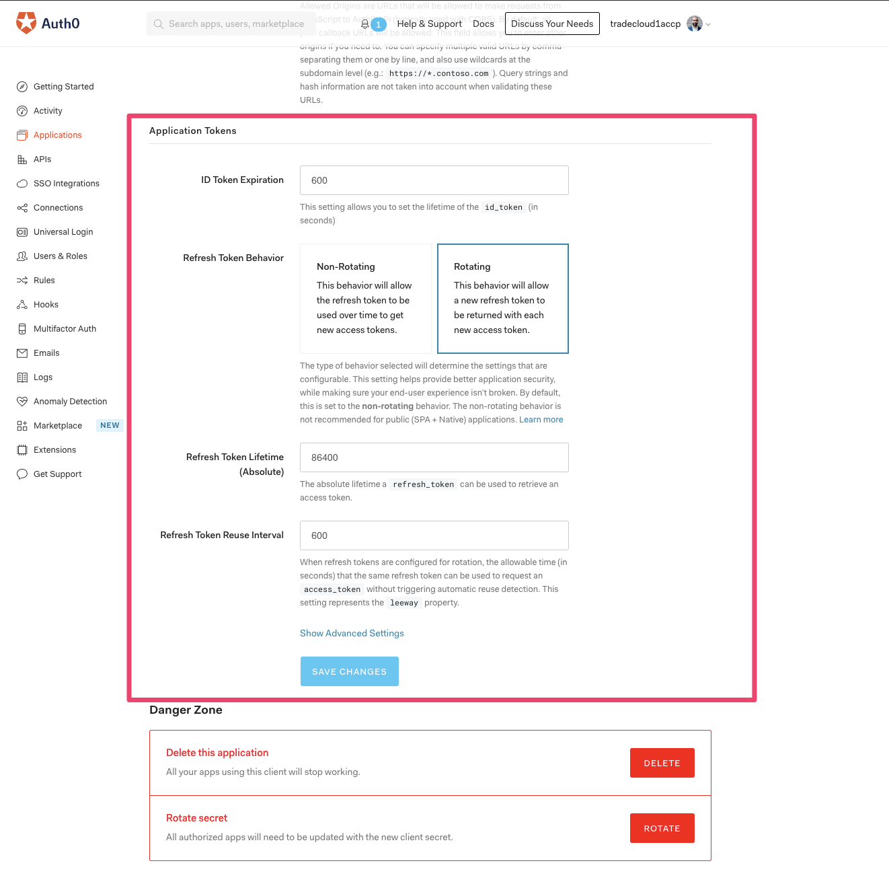

# Azure AD Connector - Auth0 Configuration


This configuration will be added by Tradecloud support.


The detailed setup process is described at this link [https://auth0.com/docs/connections/enterprise/azure-active-directory/v2\#create-an-enterprise-connection-in-auth0](https://auth0.com/docs/connections/enterprise/azure-active-directory/v2#create-an-enterprise-connection-in-auth0). We will not duplicate all the information as it can become obsolete. We have however captured the summary below just so that every time we don't need to read the full Auth0 documentation

## Connection Configuration Summary

* Navigate to the [Connections &gt; Enterprise](https://manage.auth0.com/#/connections/enterprise) page in the [Auth0 Dashboard](https://manage.auth0.com/#/), and click the `+` next to **Microsoft Azure AD**
* **ENTER A RELEVANT NAME**. Like &lt;tenant&gt;-&lt;environment&gt; e.g. damen-accp 
* Enter general information for your connection.
* Enter Client ID and Client Secret which we get after adding a new application in Azure AD
* Click **Create**.
* To use your new Azure AD enterprise connection, you must first [enable the connection](https://auth0.com/docs/dashboard/guides/connections/enable-connections-enterprise) for both portal and api applications.
* Now you're ready to [test your connection](https://auth0.com/docs/dashboard/guides/connections/test-connections-enterprise). 

## Token Configuration

Token configurations can be found under applications and selecting the portal application

The following configurations are needed

1. ID Token Expiry - This is the time after which id token will expire. To keep things consistent we can use 600 seconds as expiry i.e. same as Access Token expiry in Tradecloud Microservices
2. Refresh Token Behaviour -  Select rotating as we want to change the refresh token and use a new one after the refresh token expires 
3. Refresh Token Lifetime - We can keep it 86400 seconds i.e. 24 hours to keep it consistent with Tradecloud refresh token 
4. Refresh token reuse interval - We can use 600 to keep some buffer for the access token exchange request to come in.

