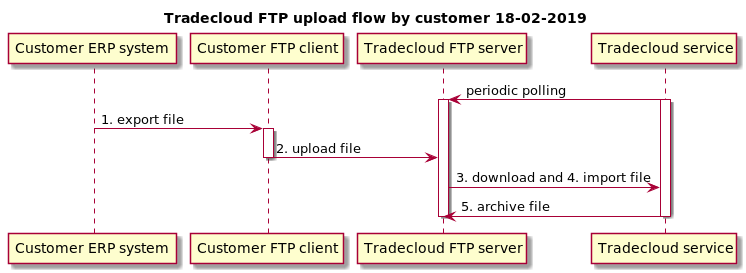
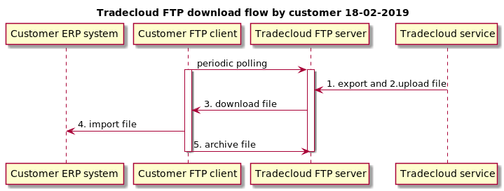

# FTP Connectors

Tradecloud provides several FTP based connectors:

* [Edifact FTP Connector](edifact-ftp-connector.md)
* [SAP IDoc XML FTP Connector](sap-idoc-ftp-connector.md)
* [CVS FTP Connector](csv-ftp-connector.md)

Your data format and transport can be set in your company integration settings by your company admin

## FTP Configuration

### Host

| Environment | Host |
| :--- | :--- |
| Acceptance test | ftp.accp.tradecloud1.com |
| Production | ftp.tradecloud1.com |

### Protocol

| Protocol | Description | Port |
| :--- | :--- | :--- |
| FTPS | Explicit FTP over TLS | 21 |
| SFTP | SSH File Transer Protocol  | 22 |
| FTP w/o encryption | &lt;not supported&gt; |  |

### Username / password

Username and password can be set in your company integration settings by your company admin

## FTP Flows

### Uploading a file to Tradecloud

| Party | Step | Folder | Description |
| :--- | :--- | :--- | :--- |
| Tradecloud | Periodic polling | order\_response | Periodically poll the folder for a new file |
| Customer | 1. Export file |  | Customer  exports a new file |
| Customer | 2. Upload file | order\_response | Customer uploads a new file |
| Tradecloud | 3. Download file | order\_response | Tradecloud downloads a new file |
| Tradecloud | 4. Import file |  | Tradecloud imports the file |
| Tradecloud | 5. Archive file. | archive/order\_response | When successfully imported,  move the file to archive |

### Downloading a file from Tradecloud

| Party | Step | Folder | Description |
| :--- | :--- | :--- | :--- |
| Customer | Periodic polling | order | Periodically poll the folder for a new file |
| Tradecloud | 1. Export file |  | Tradecloud exports a new file |
| Tradecloud | 2. Upload file | order | Tradecloud uploads a new file |
| Customer | 3. Download file | order | Customer downloads a new file |
| Customer | 4. Process file |  | Customers ERP system imports the file |
| Customer | 5. Archive file | archive/order | When successfully imported,  move the file to archive |

