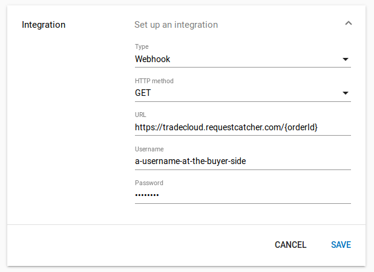

# Webhook Connector

## Using the webhook

### Step 1. Tradecloud sends a webhook trigger to your webhook service

When an order \(response\) is new or has been changed at Tradecloud, we will trigger your webhook.


You can either choose GET which will contain the order id as path or query parameter

Or you can choose POST or PUT which will contain the order event in a JSON body.


In case of GET,  the triggered webhook URL contains an order id parameter, for example:

```text
GET https://yourcompany.com/any/path/:orderId
```

### Step 2. Your webhook service fetches the actual order from Tradecloud

In case of **GET**, using the order id, you can fetch the actual order from Tradecloud:

```text
GET https://api.accp.tradecloud1.com/order/:orderId
```


[API v2 GET order specification](https://swagger-ui.accp.tradecloud1.com/?url=https://api.accp.tradecloud1.com/v2/order/specs.yaml#/order/getOrderByIdRoute)


```text
GET https://test.tradecloud.nl/api/v1/purchaseOrder/:orderId
```


[API v1 GET purchaseOrder specification](https://test.tradecloud.nl/api/v1/docs#!/Purchase_order_API/getOrder)


In case of **POST** or **PUT** you can use the order event inside the request JSON body.

## Setting up your webhook service

To receive a webhook trigger you will need:

* a **simple web service** reachable from the internet, which listens to some URL
* the web service should support **SSL** **only** and you will need a **SSL certificate**


Self-signed certificates are NOT supported


* the web service should be configured to use **TLS v1.2**


You can test the security level of your certificate at [SSL Labs](https://www.ssllabs.com/ssltest/)


* the web service should support **basic authentication**
* the HTTP method should be either **GET, POST** or **PUT**



Webhook with order id



The GET webhook method is used to send the order id when the order \(response\) is new or has been updated.






order identifier





order identifier










```

```







Webhook with event



The POST and PUT webhook method is used to send the order event when the order \(response\) is new or has been updated.






Order event JSON body










```


```






The webhook body is equal to the [Find order by id](https://swagger-ui.accp.tradecloud1.com/?url=https://api.accp.tradecloud1.com/v2/order/specs.yaml#/order/getOrderByIdRoute) response body  
The body will ONLY contain the lines affected by the order event.



A **legacy** **order** will also contain the legacyOrderId, but no version.


## Configure your webhook in Tradecloud1

As a company admin you may configure a webhook in your company profile on the [Tradecloud1 platform](http://portal.tradecloud1.com/):



* Type: select Webhook
* HTTP method: select **GET**, **POST** or **PUT**
* URL: enter your webhook URL. **https** and either **{orderId}** or **{legacyOrderId}** are required.
* Username: enter the **username** as configured in your webhook service
* Password: enter the **password** as configured in your webhook service


Use **{orderId}** when you use API version 2 on tradecloud1.com  
Use **{legacyOrderId}** when you use API version 1 on tradecloud.nl



You can test webhook triggers using [webhook.site](https://webhook.site)  
Use bogus username and password.



