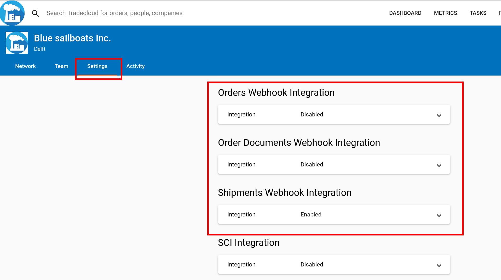
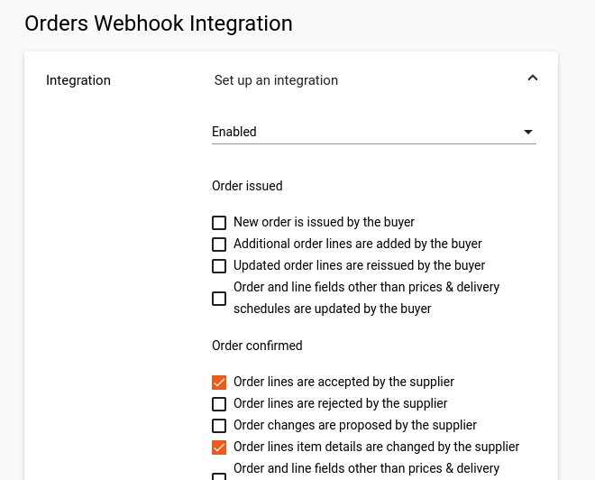
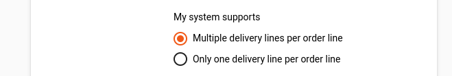
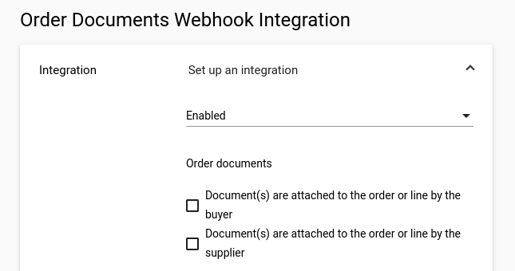
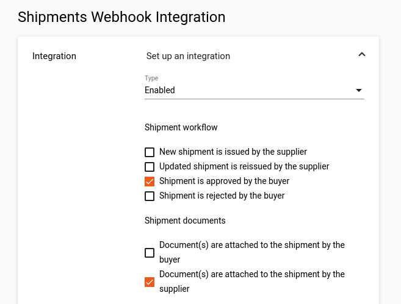
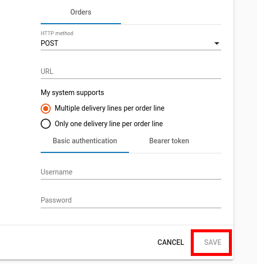

# Configure the webhook

## Configure your webhooks in the Tradecloud1 portal

### Select one or more webhooks

As a company admin configure one or more webhooks in your company settings on the [Tradecloud1 platform](http://portal.tradecloud1.com):

* Select **My company** in the menu below your avatar.
* The **Settings** tab in the Company menu should be selected.
* Configure one or more **Webhook Integration**s below.

### Orders Webhook Integration

Enable the **Order Webhook Integration** if you want to receive a webhook trigger when an order has been issued or changed:

A default set of order events will be enabled. The actual set you want to select wil be dependent on the capabilities of your integration and ERP system. You can find a list of events here:



In case of the order webhook you can choose between 
- Multiple delivery lines per order line, also known as the **native** delivery schedule
- Only on delivery line per order line, also known as the **simple**  delivery schedule

See [the API manual](https://docs.tradecloud1.com/api/introduction/api/delivery-schedule) to read about the native versus the simple delivery schedule.

### Order Documents Webhook Integration

Enable the **Order Documents Webhook Integration** if you want to receive a webhook trigger when an order document has been attached:

A default set of order document events will be enabled. The actual set you want to select wil be dependent on the capabilities of your integration and ERP system. You can find a list of events here:



### Shipments Webhook Integration

Enable the **Order Webhook Integration** if you want to receive a webhook trigger when a shipment has been issued or changed:

A default set of shipments events will be enabled. The actual set you want to select wil be dependent on the capabilities of your integration and ERP system. You can find a list of events here:



### Configure method, url and credentials

* Select **GET** or **POST** as HTTP method.
* Enter your webhook **URL**
  * **https** is required.
  * use the **{orderId}** variable in the URL in case of **GET** method.
* Enter either **Basic authentication** username and password or a static **Bearer token.**
* Save the settings


You can test webhook triggers using [webhook.site](https://webhook.site)
Int that case, use a bogus username and password.

